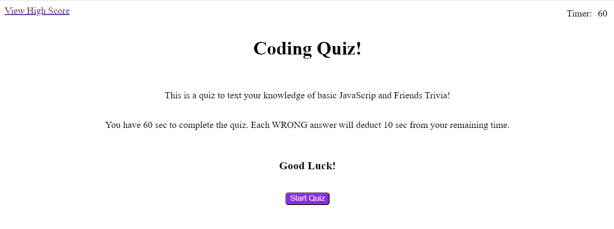

# CodeQuiz

## 4 question quiz testing JavaScript knowledge and Friends trivia

### Technologies used:
* HTML
* CSS
* JavaScript
* Web-API

### Functions:
* CSS and HTML are created & modifies in JS
* Timer starts at 60 on quiz start
    * 10 seconds deducted for each wrong answer
* 1 point for each correct answer
    * Highest score is recorded (or matched) in localStorage
* Correct/Wrong Feedback shown for 1.5 seconds after each answer selection
